# Видео курс - Основы PHP

### Перейти к видео (клик по изображению)
<a href="https://youtu.be/M-peGbXCvNA" target="_blank">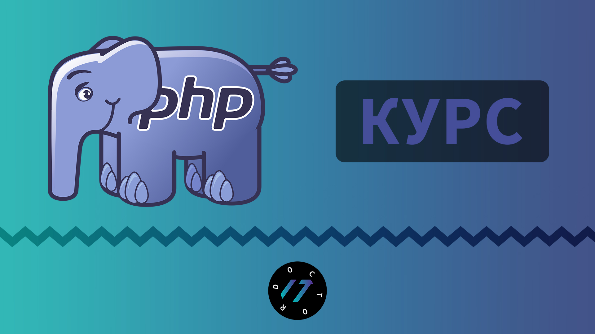</a>

## Оглавление
00:00 - Первый скрипт Hello World на PHP  
09:52 - Конец строки  
19:29 - Комментарии  
25:32 - Подключение файла  
30:18 - Переменные и типы данных  
38:00 - Целые и вещественные числа  
45:16 - Логический и строковый тип данных  
54:38 - Базовые функции языка  
1:03:06 - Явное и неявное приведение типов  
1:12:02 - Округление чисел  
1:20:30 - ООП: Классы и объекты  
1:30:40 - Области видимости переменных класса  
1:41:45 - Расстояние между двумя точками  
1:47:59 - Константы  
1:59:44 - Путь к файлу, константы класса  
2:08:33 - Конкатенация строк  
2:12:32 - Арифметические операторы  
2:22:45 - Поразрядные операторы  
2:34:49 - Операторы сравнения  
2:41:01 - Условный оператор if  
2:53:16 - Логические операторы  
3:04:24 - Тернарный условный оператор, ??, goto  
3:16:36 - Переключатель switch  
3:27:57 - Чтение из файла и запись в файл  
3:37:22 - Цикл while  
3:50:54 - Цикл do while  
3:53:54 - Цикл for  
4:05:11 - Массивы  
4:14:12 - Ассоциативные массивы  
4:17:32 - Многомерные массивы  
4:22:14 - Интерполяция элементов массива в строки  
4:25:33 - Конструкция list  
4:30:21 - Обход массива циклом for и foreach  
4:43:21 - Слияние и сравнение массивов  
4:49:32 - Проверка существования и удаление элементов массива  
4:57:42 - Задачи на понимание массивов  
5:05:23 - Функции  
5:14:22 - Параметры и аргументы функций  
5:21:22 - Глобальные и статические переменные  
5:28:56 - Рекурсия, вложенные и анонимные функции   
5:42:20 - Замыкания и задачи на понимание функций  
5:49:56 - Работа со строками  
5:57:41 - Работа с подстроками  
6:08:53 - Функции для работы с HTML  
6:13:55 - Форматный вывод  
6:21:04 - Работа с JSON  
6:24:31 - Передача параметров методом GET  
6:33:53 - Передача параметров методом POST  
6:44:43 - Работа с элементами формы checkbox, radio, select  
6:52:48 - Загрузка файлов на сервер  
7:01:05 - Форма обратной связи, отправка письма на почту  
7:19:35 - Методы класса  
7:29:20 - Конструктор класса  
7:35:36 - Наследование и перегрузка методов  
7:40:55 - abstract и final классы и методы  

### 1. Первый скрипт на PHP
PHP - Серверный язык. 1:37 Курс по Open Server  
2:10 Учим основы программирования на примере языка   JavaScript  
Расширение файлов .php  
\<?php ?> - php тег  
echo - для вывода на экран

> lesson1
### 2. Конец строки
Конец строки отделяется спомощью точки с запятой.  
\<?= "Текст"; ?> сокращенный тег php   
тоже самое что и \<?php echo "Текст"; ?>  
date(DATE_RSS); - выводит дату https://www.php.net/manual/ru/function.date.php   
mt_rand(0,1); - генерирует случайное число от 0 до 1
https://www.php.net/manual/ru/function.mt-rand

> lesson2
### 3. Комментарии
Комментарии нужны только для программиста.  
\# Однострочный комментарий в стили Python  
//Однострочный комментарий (классический)  
/*  
Многострочный  
комментарий  
*/  
\<!-- HTML комментарий -->  
В VS Code можно закоментировать с помощью CTRL+/

> lesson3
### 4. Подключени файла
include 'каталог/файл.php';  
https://www.php.net/manual/ru/function.include.php  
require 'каталог/файл.php';  
https://www.php.net/manual/ru/function.require.php

> lesson4
### 5. Переменные и типы данных
Переменная всегда начинается знаком доллара, например $var = 5;  
Названия переменных на php чувствительны к регистру.

> lesson5
### 6. Целые и вещественные числа
10 - DEC Число  
-10 - Отрицательное DEC число  
012 - OCT числа  
0x12A - HEX числа  
5.631 - Вещественное число  
5.0e-3 - 5.0*10^-3  
5.0e+3 - 5.0*10^+3

> lesson6
### 7. Логический и строковый тип данных
true и false - можно записывать в любом регистре  
Строки записываются в ковычках, например $str = "Строка";

> lesson7
### 8. Базовые функции языка
isset() - Определяет, была ли установлена переменная значением, отличным от null  
https://www.php.net/manual/ru/function.isset  
empty() - Проверяет, пуста ли переменная  
https://www.php.net/manual/ru/function.empty  
gettype() - Возвращает тип переменной  
https://www.php.net/manual/ru/function.gettype  
is_int() - Проверяет, является ли переменная целым числом  
https://www.php.net/manual/ru/function.is-int

> lesson8
### 9. Явное и неявное приведение типов
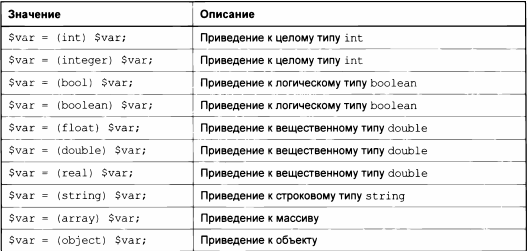

> lesson9
### 10. Округление чисел
is_numeric() - Проверяет, является ли переменная числом или строкой, содержащей число  
https://www.php.net/manual/ru/function.is-numeric  
round() - Округляет число типа float  
https://www.php.net/manual/ru/function.round  
floor() - Округляет дробь в меньшую сторону  
https://www.php.net/manual/ru/function.floor  
ceil() - Округляет дробь в большую сторону  
https://www.php.net/manual/ru/function.ceil  
decbin() - Переводит число из десятичной системы счисления в двоичную  
https://www.php.net/manual/ru/function.decbin

> lesson10
### 11. ООП: Классы и объекты
unset() - Удаляет переменную  
https://www.php.net/manual/ru/function.unset

> lesson11
### 12. Области видимости переменных класса
public - Переменная доступна везде  
private - Переменная доступна только в классе  
protected - Доступ имеется из класса, унаследованных классов и родительских  
static - Статическая переменная  
https://www.php.net/manual/ru/language.oop5.visibility.php
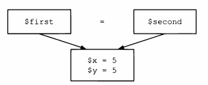

> lesson12
### 13. Расстояние между двумя точками
clone - Клонировать объект а не указывать на него ссылку  
pow() - Возведение в степень  
https://www.php.net/manual/ru/function.pow  
sqrt() - Квадратный корень  
https://www.php.net/manual/ru/function.sqrt
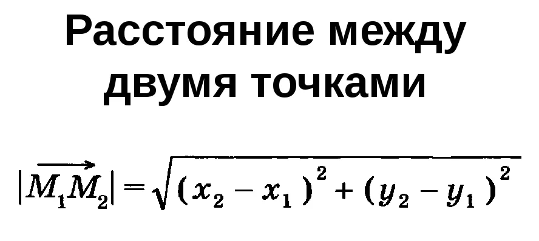

> lesson13
### 14. Константы
define() - Определяет именованную константу  
https://www.php.net/manual/ru/function.define  
defined() - Проверяет существование указанной именованной константы  
https://www.php.net/manual/ru/function.defined  
constant() - Возвращает значение константы  
https://www.php.net/manual/ru/function.constant  
Магические константы  
https://www.php.net/manual/ru/language.constants.predefined.php

> lesson14
### 15. Путь к файлу, константы класса
require_once() - проверит, включался ли уже данный файл, и если да, не будет включать его еще раз  
https://www.php.net/manual/ru/function.require-once.php

> lesson15
### 16. Конкатенация строк
echo() - Выводит одну или более строк  
https://www.php.net/manual/ru/function.echo

> lesson16
### 17. Арифметические операторы
>\+ Сложение  
\- Вычитание  
\* Умножение  
/ Деление  
** Возведение в степень  
% Остаток от деления  
\++ Инкремент  
\-- Декремент  

> lesson17
### 18. Поразрядные операторы
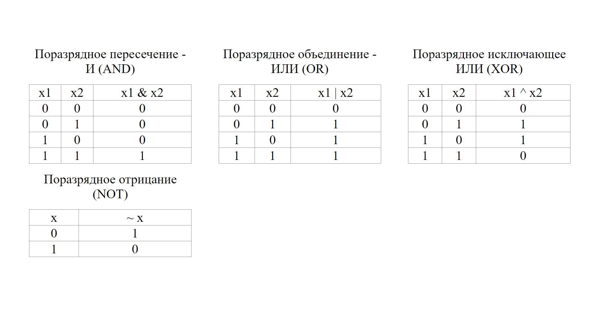

> lesson18
### 19. Операторы сравнения
Приоритеты выполнениря операторов в PHP  
https://www.php.net/manual/ru/language.operators.precedence.php

> lesson19
### 20. Условный оператор if
#### Синтаксис:
> if(условие) {  
  //действие  
} elseif(условие) {  
  //действие  
} else {  
  //действие  
}

#### Блок схемы для условных конструкций
<table>
  <tr>
    <td>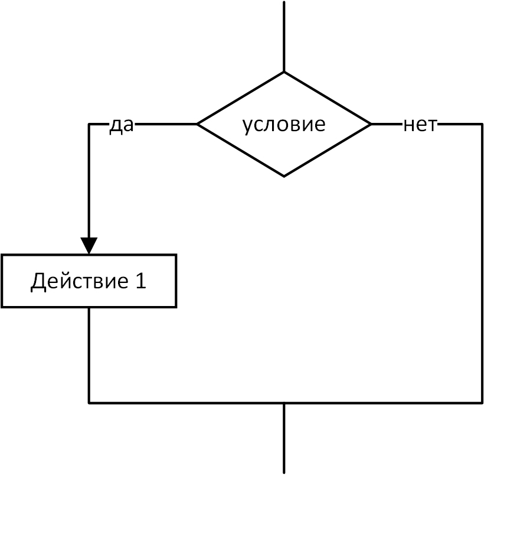</td>
    <td>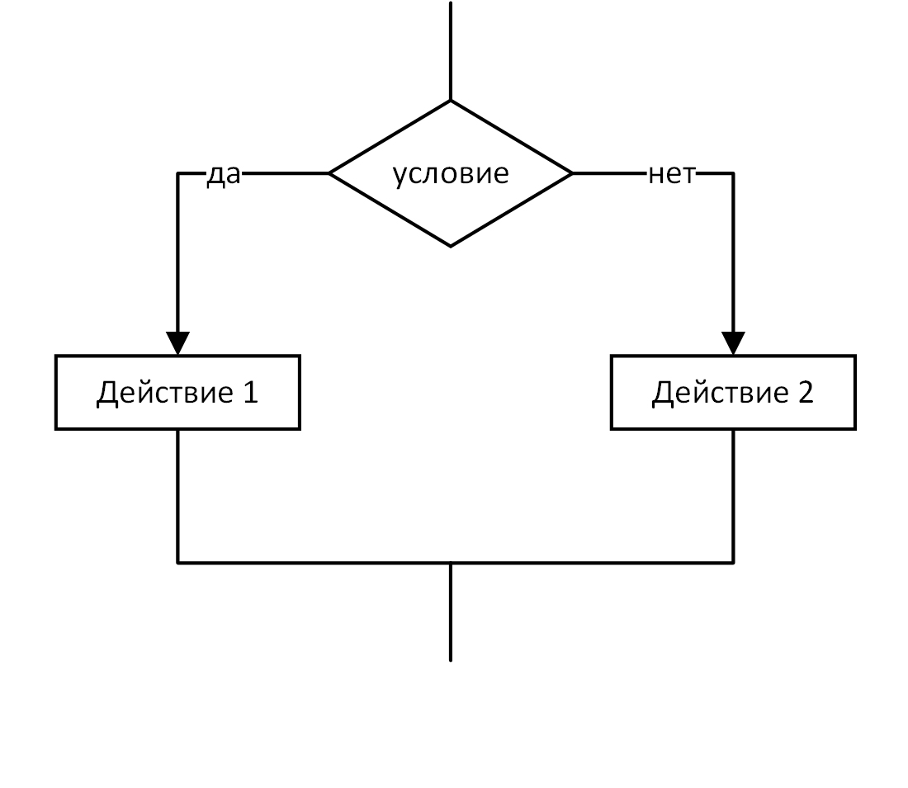</td>
  </tr>
  <tr>
    <td>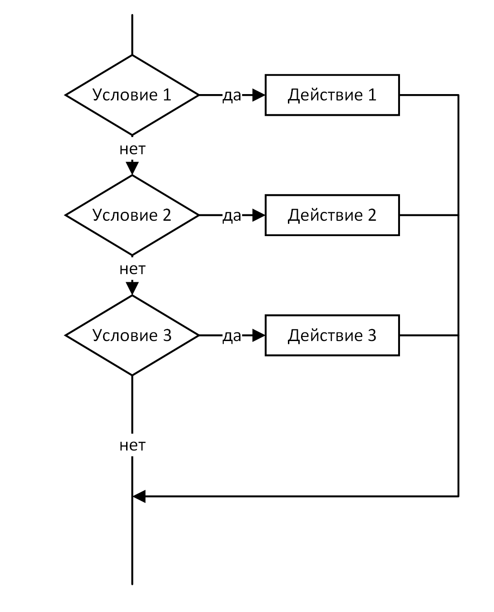</td>
    <td>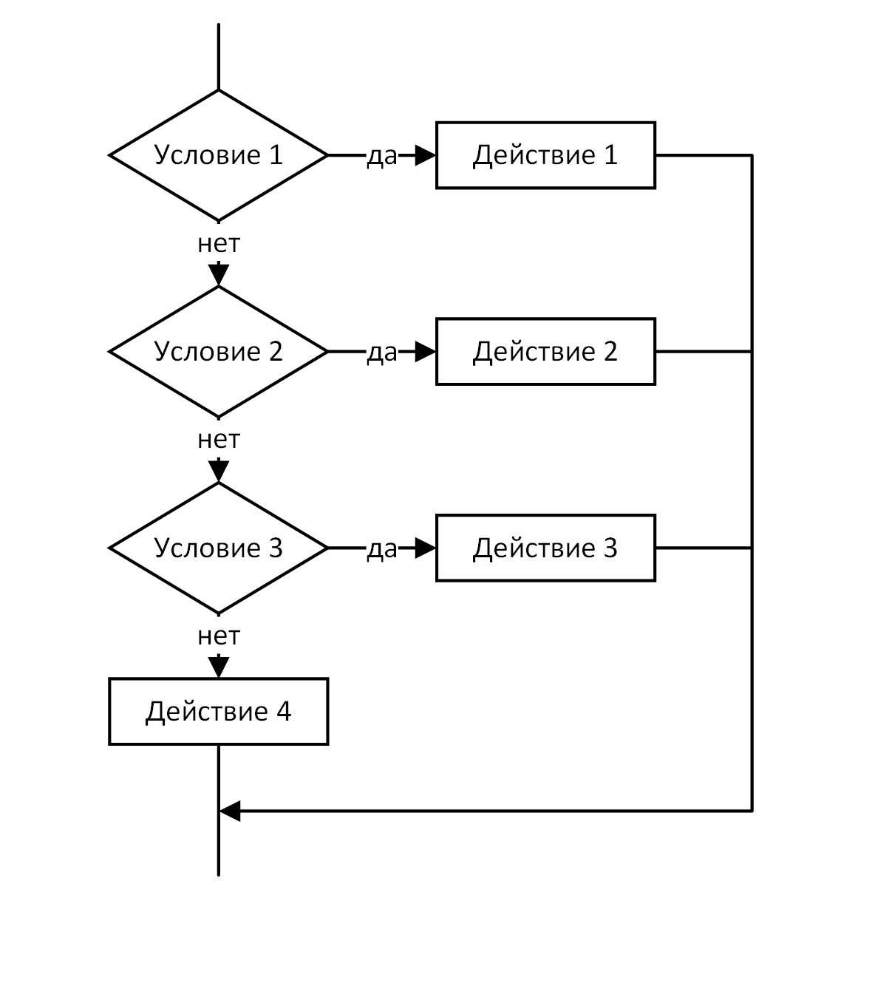</td>
  </tr>
</table>

> lesson20
### 21. Логические операторы
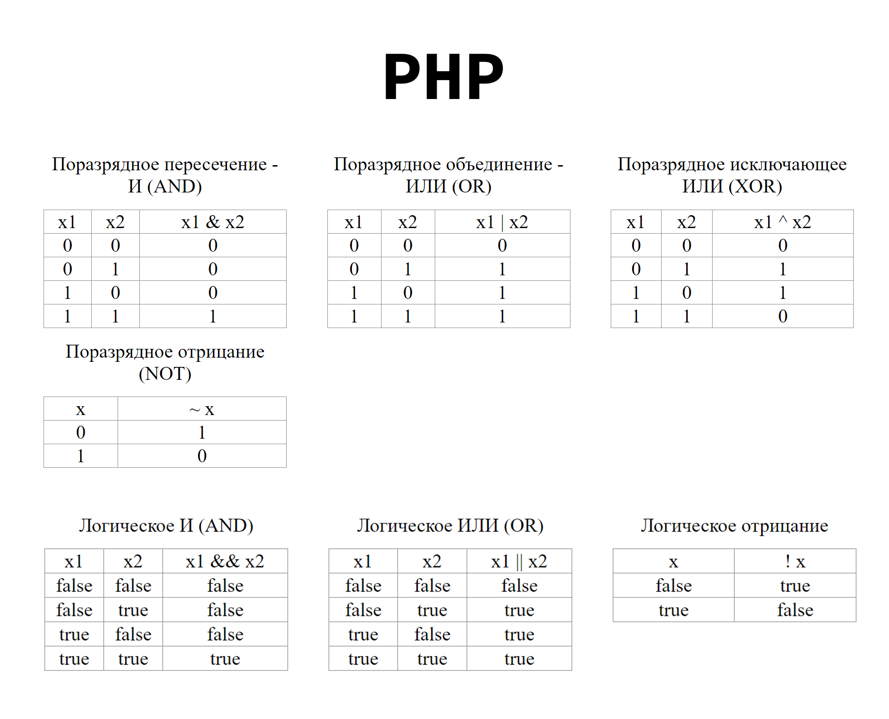

> lesson21
### 22. Тернарный условный оператор, ??, goto
#### Синтаксис:
> выражени1 ? выражение2 : выражение3

> lesson22
### 23. Переключатель switch
#### Синтаксис:
> switch(проверка) {  
  >>case значение1:  
    >>>выражение  
    >>>...  
    >>>break;  
    >>  
  >>case значениеN:  
    >>>выражение  
    >>>...  
    >>>break;  
    >>  
  >>default:  
    >>>выражение  
    >>>...  
>  
>}

> lesson23
### 24. Чтение из файла и запись в файл
Чтение из файла: https://www.php.net/manual/ru/function.file-get-contents.php  
Запись в файл: https://www.php.net/manual/ru/function.file-put-contents  
Дата: https://www.php.net/manual/ru/function.date
> lesson24
### 25. Цикл while
#### Блок схема цикла while
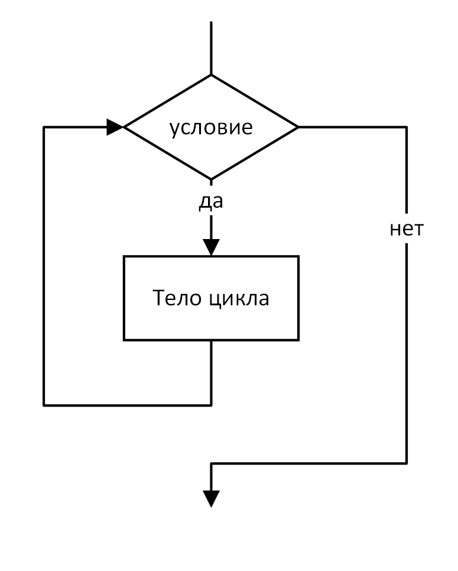

> lesson25
### 26. Цикл do while
#### Блок схема цикла do while
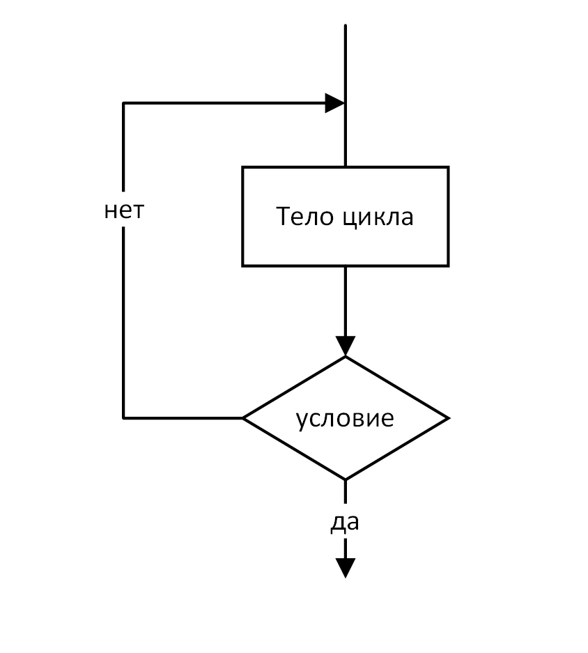

> lesson26
### 27. Цикл for
#### Блок схема цикла for
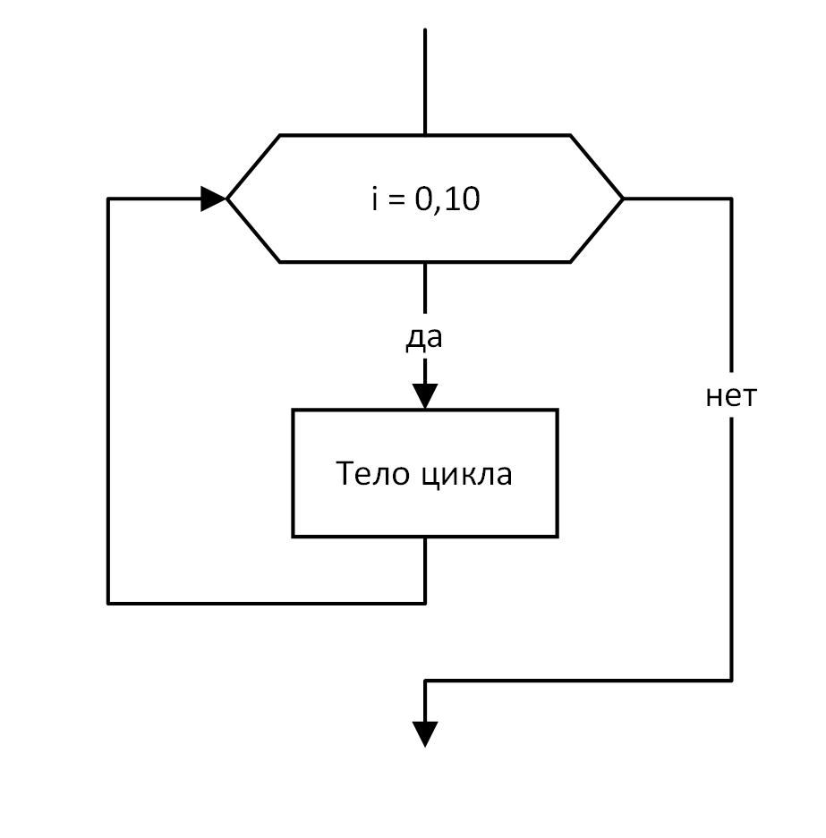

> lesson27
### 28. Массивы
print_r() - Выводит удобочитаемую информацию о переменной  
https://www.php.net/manual/ru/function.print-r
> lesson28
### 29. Ассоциативные массивы
> lesson29
### 30. Многомерные массивы
> lesson30
### 31. Интерполяция элементов массива в строки
> lesson31
### 32. Конструкция list
list() - Присваивает переменным из списка значения подобно массиву  
https://www.php.net/manual/ru/function.list

> lesson32
### 33. Обход массива циклом for и foreach
> lesson33
### 34. Слияние и сравнение массивов
array_merge() - Сливает один или большее количество массивов  
https://www.php.net/manual/ru/function.array-merge

> lesson34
### 35. Проверка существования и удаление элементов массива
array_key_exists() - Проверяет, присутствует ли в массиве указанный ключ или индекс  
https://www.php.net/manual/ru/function.array-key-exists  
array_search() - Осуществляет поиск данного значения в массиве и возвращает ключ первого найденного элемента в случае удачи  
https://www.php.net/manual/ru/function.array-search

> lesson35
### 36. Задачи на понимание массивов
rand() - Генерирует случайное число  
https://www.php.net/manual/ru/function.rand  
count() - Подсчитывает количество элементов массива или чего-либо в объекте  
https://www.php.net/manual/ru/function.count  
sort() - Сортирует массив  
https://www.php.net/manual/ru/function.sort  
file() - Читает содержимое файла и помещает его в массив  
https://www.php.net/manual/ru/function.file

> lesson36
### 37. Функции
> lesson37
### 38. Параметры и аргументы функций
> lesson38
### 39. Глобальные и статические переменные
> lesson39
### 40. Рекурсия, вложенные и анонимные функции
usort() - Сортирует массив по значениям используя пользовательскую функцию для сравнения элементов  
https://www.php.net/manual/ru/function.usort

> lesson40
### 41. Замыкания и задачи на понимание функций
> lesson41
### 42. Работа со строками
strlen() - Возвращает длину строки  
https://www.php.net/manual/ru/function.strlen  
mb_strlen() - Получает длину строки  
https://www.php.net/manual/ru/function.mb-strlen  
chr() - Генерирует односимвольную строку по заданному числу  
https://www.php.net/manual/ru/function.chr  
ord() - Конвертирует первый байт строки в число от 0 до 255  
https://www.php.net/manual/ru/function.ord

> lesson42
### 43. Работа с подстроками
substr() - Возвращает подстроку  
https://www.php.net/manual/ru/function.substr  
strpos() - Возвращает позицию первого вхождения подстроки  
https://www.php.net/manual/ru/function.strpos  
str_replace() - Заменяет все вхождения строки поиска на строку замены  
https://www.php.net/manual/ru/function.str-replace  
trim() - Удаляет пробелы (или другие символы) из начала и конца строки  
https://www.php.net/manual/ru/function.trim  
strlen() - Возвращает длину строки  
https://www.php.net/manual/ru/function.strlen

> lesson43
### 44. Функции для работы с HTML
htmlspecialchars() - Преобразует специальные символы в HTML-сущности  
https://www.php.net/manual/ru/function.htmlspecialchars  
strip_tags() - Удаляет теги HTML и PHP из строки  
https://www.php.net/manual/ru/function.strip-tags  
nl2br() - Вставляет HTML-код разрыва строки перед каждым переводом строки  
https://www.php.net/manual/ru/function.nl2br
> lesson44
### 45. Форматный вывод
printf() Выводит отформатированную строку
https://www.php.net/manual/ru/function.printf.php  
explode() - Разбивает строку с помощью разделителя  
https://www.php.net/manual/ru/function.explode  
implode() - Объединяет элементы массива в строку  
https://www.php.net/manual/ru/function.implode

> lesson45
### 46. Работа с JSON
json_encode() - Возвращает JSON-представление данных  
https://www.php.net/manual/ru/function.json-encode  
json_decode() - Декодирует строку JSON  
https://www.php.net/manual/ru/function.json-decode

> lesson46
### 47. Передача параметров методом GET
urlencode() - URL-кодирование строки  
https://www.php.net/manual/ru/function.urlencode  
urldecode() - Декодирование URL-кодированной строки  
https://www.php.net/manual/ru/function.urldecode  
parse_url() - Разбирает URL и возвращает его компоненты  
https://www.php.net/manual/ru/function.parse-url

> lesson47
### 48. Передача параметров методом POST
Ссылка в описании и подсказках на работу с формами на HTML
> lesson48
### 49. Работа с элементами формы checkbox, radio, select
> lesson49
### 50. Загрузка файлов на сервер
move_uploaded_file() - Перемещает загруженный файл в новое место  
https://www.php.net/manual/ru/function.move-uploaded-file

> lesson50
### 51. Форма обратной связи, отправка письма на почту
header — Отправка HTTP-заголовка  
https://www.php.net/manual/ru/function.header  
phpversion — Получает текущую версию PHP  
https://www.php.net/manual/ru/function.phpversion  
mail — Отправляет электронную почту  
https://www.php.net/manual/ru/function.mail

> lesson51
### 52. Методы класса
> lesson52
### 53. Конструктор класса
> lesson53
### 54. Наследование и перегрузка методов
> lesson54
### 55. abstract и final классы и методы
> lesson55

## Ссылки на полезные видео уроки:
1. <a href="https://youtu.be/2yT8jMgWvko" target="_blank">Основы программирования на примере Java Script</a>
2. <a href="https://youtu.be/4rkj2CUpzpE" target="_blank">ООП на Java Script</a>
3. <a href="https://youtu.be/LJCfPmbU4sc" target="_blank">ООП на PHP</a>
4. <a href="https://youtu.be/daJgnaNC_1U" target="_blank">Квадратное уравнение на Java Script</a>
5. <a href="https://youtu.be/uY0I4c3nwfA" target="_blank">Блок-схемы алгоритмов</a>
6. <a href="https://www.php.net/manual/ru/" target="_blank">Оффициальная документация на русском языке</a>

---

